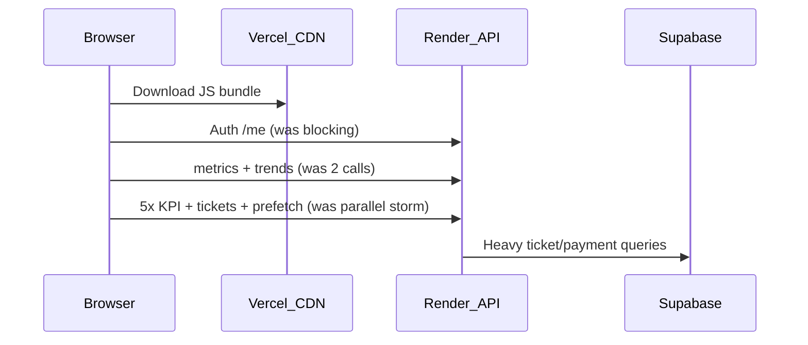

# Fast load (1–2 second target) and load balancer guide

This doc explains **why** the app was slow, **what we changed**, and **when** you need NGINX/load balancing vs Render/Vercel as-is.

---

## What you feel as “loading time”



| Phase | Before (~15s) | After first pass (~7–10s) | Now (target 1–2s perceived) |
|--------|----------------|---------------------------|---------------------------|
| Login spinner | Wait for `/auth/me` | Same | **UI from sessionStorage immediately** |
| Dashboard cards | metrics + trends + 5 KPIs + tickets + prefetch | Throttled prefetch | **One `/dashboard/bootstrap` call** |
| Extra widgets | All at once | Batched KPI (2) | **KPI / leads / payment deferred 1.5–3s** |
| Repeat visit | Full refetch | Some cache | **60s server cache + session cache** |

**Honest target:** Sub‑**2s** for **main dashboard numbers** on a **warm** Render instance is realistic. **Under 1s** every time needs always‑on Render (no cold start) + warm cache hit. Cold start after sleep can still be 5–15s for the **first** API call.

---

## Backend changes (Render)

### 1. `GET /dashboard/bootstrap`

- Runs **metrics + trends in parallel** on the server (one browser round-trip).
- Response cached **45s** per user email (`_DASH_BOOTSTRAP_CACHE`).
- Sends **ETag** + `Cache-Control` for browser/CDN-friendly reuse.

### 2. Per-endpoint caches

| Cache | TTL | Key |
|--------|-----|-----|
| `_DASH_METRICS_CACHE` | 60s | user email |
| `_DASH_TRENDS_CACHE` | 120s | global |
| `_PAYMENT_SUMMARY_CACHE` | 60s | date (existing) |

### 3. Lighter DB read

- Dashboard “last week” tickets: `select("*")` → **minimal columns** only.

### 4. Rate limiting (already added)

- Protects Render from retry/prefetch storms (`app/rate_limit.py`).

**Deploy:** Push backend → **Redeploy Render** service.

**Optional Render env:**

```env
RATE_LIMIT_GLOBAL_MAX_REQUESTS=200
RATE_LIMIT_EXPENSIVE_MAX_REQUESTS=30
```

**Keep-alive (fixes cold start):** See **[RENDER_KEEPALIVE_SETUP.md](RENDER_KEEPALIVE_SETUP.md)** — GitHub Action (`.github/workflows/render-keepalive.yml`) or cron-job.org every 5 min → `GET https://ip-internal-manage-software.onrender.com/health`

---

## Frontend changes (Vercel)

### 1. `dashboardApi.getBootstrap()`

- Dashboard page uses **one** request instead of metrics + trends.

### 2. Deferred work (does not block first paint)

| Data | Delay |
|------|--------|
| Ticket export list | `requestIdleCallback` / 800ms |
| Active leads + payment actions | 1.5s |
| Team KPI snapshot (5 people) | 2.5s |
| Success KPI (Rimpa) | 3s |

### 3. Auth: stale-while-revalidate

- If token + user exist in `sessionStorage` → **show app immediately**, refresh `/auth/me` in background.

### 4. Prefetch

- **12s delay** after login before idle prefetch.
- **No** immediate warm of 10 routes.
- Dashboard prefetch uses **bootstrap** only.

**Deploy:** Push frontend → **Redeploy Vercel**.

---

## Load balancer — do you need it?

| Your setup | Recommendation |
|------------|----------------|
| **Render: 1 web service** (current) | **No NGINX required.** Use Render URL in `VITE_API_BASE_URL`. Add **health keep-alive** instead. |
| **Self-hosted VM / Docker** | Use **`docker-compose.nginx.yml`** + `deploy/nginx/nginx.conf` (3 FastAPI instances behind NGINX). |
| **Render: scale to 2+ instances** | Render’s load balancing is built-in; move rate-limit counters to **Redis** (in-memory limits are per instance). |

Files already in repo:

- `docker-compose.nginx.yml`
- `deploy/nginx/nginx.conf`
- `docs/NGINX_LOAD_BALANCER_SETUP.md`

**NGINX does not fix slow Supabase queries** — it only spreads traffic across CPUs. Your win comes from **fewer calls**, **caching**, and **deferring** heavy widgets.

---

## How to verify after deploy

1. Open DevTools → **Network** → filter `bootstrap`.
2. **First load (warm):** one `dashboard/bootstrap` &lt; ~2s TTFB.
3. **Reload within 60s:** should be faster (server + session cache).
4. KPI cards may fill in **2–3s after** main metrics (by design).

---

## If still slow

1. Confirm **Render redeployed** (latest `main.py` with bootstrap).
2. Confirm **Vercel** rebuilt with latest frontend.
3. Run **keep-alive** on `/health`.
4. Run `docs/supabase_performance_indexes.sql` in Supabase (if not done).
5. Upgrade Render to **always-on** plan to remove cold starts.

---

## File map (this optimization)

| File | Role |
|------|------|
| `backend/app/main.py` | bootstrap route, metrics/trends TTL cache |
| `backend/app/rate_limit.py` | API protection |
| `fms-frontend/src/api/dashboard.ts` | `getBootstrap()` |
| `fms-frontend/src/pages/Dashboard.tsx` | bootstrap + deferred loads |
| `fms-frontend/src/contexts/AuthProvider.tsx` | instant session paint |
| `fms-frontend/src/utils/routePrefetch.ts` | delayed/light prefetch |
| `fms-frontend/src/components/layout/AppLayout.tsx` | 12s prefetch delay |
